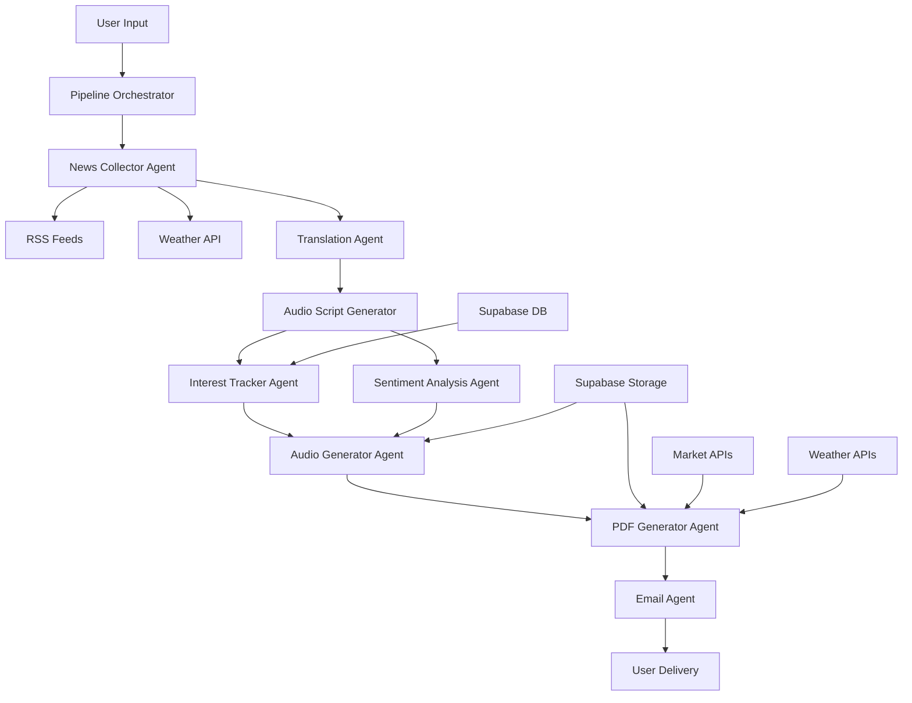

# News Agent - AI-Powered Personalized News Digest System


A sophisticated, multi-agent AI system that collects, analyzes, personalizes, and delivers news content across multiple formats including email, PDF, and audio. The system leverages LangChain orchestration, sentiment analysis, multi-language support, and personalized recommendations.

## 🌟 Features

### Core Capabilities
- **🤖 Multi-Agent AI Pipeline**: Orchestrated workflow with specialized agents
- **📰 Multi-Source News Collection**: RSS feeds from premium sources
- **🎯 Personalized Content**: User interest tracking and recommendations
- **🌍 Multi-Language Support**: Hindi and English languages
- **📊 Sentiment Analysis**: Real-time market sentiment tracking
- **🎵 Audio Generation**: Text-to-speech with multi-language support
- **📄 PDF Reports**: Professional-grade digest reports
- **📧 Email Delivery**: Automated digest delivery with attachments
- **🌤️ Weather Integration**: Multi-city weather forecasts
- **📈 Market Analysis**: Real-time stock market data and insights

### Advanced Features
- **🔍 State-wise News Filtering**: Location-based news curation
- **📊 Historical Trend Analysis**: 7-day trend tracking
- **🎨 Dynamic Visualizations**: Charts and sentiment graphs
- **🔐 User Authentication**: Secure user management with Supabase
- **☁️ Cloud Storage**: PDF and audio file storage
- **📱 Responsive Design**: Mobile-first UI with shadcn/ui

## 🏗️ Architecture & Tech Stack

### Frontend Technologies
```typescript
// Core Framework
- Next.js 16.0.0 (App Router)
- React 19.2.0
- TypeScript 5+
- Tailwind CSS 3.4.1

// UI Components
- shadcn/ui (Radix UI primitives)
- Lucide React (Icons)
- next-themes (Dark/Light mode)
- Recharts (Data visualization)

// Form Handling
- React Hook Form 7.60.0
- Zod 3.25.76 (Schema validation)
- @hookform/resolvers
```

### Backend & AI Technologies
```typescript
// AI & Language Models
- LangChain Core 0.3.77
- Google Gemini AI (gemini-2.0-flash)
- @langchain/google-genai 0.2.18

// News Processing
- Cheerio 1.1.2 (HTML parsing)
- Node Fetch 3.3.2 (HTTP requests)

// Document Generation
- PDF-lib 1.17.1 (PDF creation)
- google-tts-api 0.0.6 (Text-to-speech)

// Email System
- Nodemailer 7.0.10
- @react-email/render 1.4.0
```

### Database & Storage
```typescript
// Database
- Supabase (PostgreSQL)
- Real-time subscriptions
- Row Level Security (RLS)

// Storage Buckets
- PDF Storage: pdf-digests
- Audio Storage: audio-digests
- Public URL generation
```

### External APIs & Services
```typescript
// News Sources
- RSS Feeds (The Hindu, Times of India, BBC, NY Times, etc.)
- Google News API integration

// Weather Data
- OpenWeatherMap API
- 5-day forecasts
- Multi-city support

// Market Data
- Yahoo Finance API
- Real-time stock indices
- NIFTY 50, SENSEX, Bank NIFTY

// AI Services
- Google Generative AI (Gemini)
- Google Cloud Text-to-Speech
- Google Translate API
```

## 🔄 Complete Workflow & Data Flow

### 1. Pipeline Orchestration (orchestrator.ts)

The system uses **LangChain RunnableSequence** for orchestrating the multi-step pipeline:

```typescript
const pipeline = RunnableSequence.from([
  collectorStep,      // Step 1: News Collection
  translationStep,    // Step 2: Language Translation
  audioScriptStep,    // Step 3: Audio Script Generation
  parallelStep,       // Step 4-5: Interest Tracking + Sentiment Analysis
  audioGenerationStep,// Step 6: Audio File Creation
  enrichmentStep,     // Step 7: Article Enrichment
  pdfGenerationStep,  // Step 8: PDF Report Generation
  emailStep,          // Step 9: Email Delivery
]);
```

### 2. Agent Architecture

#### **🗞️ Collector Agent** (`collector.ts`)
```typescript
// Responsibilities:
- RSS feed parsing from 15+ premium sources
- Article deduplication by URL/title
- State-wise filtering with AI assistance
- Weather data integration
- Content validation and sanitization

// Data Flow:
Input: { topic, language, location, state }
Output: { articles[], weather, metadata }

// Sources:
- The Hindu, Times of India, Indian Express
- BBC, NY Times, Reuters
- ESPN, TechCrunch, Wired
```

#### **🧠 Sentiment Analysis Agent** (`sentiment.ts`)
```typescript
// Batch Processing:
export async function analyzeSentimentsBatch(
  articles: Array<{ title: string; summary: string }>
): Promise<SentimentResult[]>

// Classification:
- Positive: Growth, success, improvements
- Negative: Crisis, decline, concerning news
- Neutral: Factual, balanced reporting

// Output Schema:
{
  sentiment: "positive" | "negative" | "neutral",
  score: 0.0-1.0,
  reasoning: string
}
```

#### **🎵 Audio Generator Agent** (`audioGenerator.ts`)
```typescript
// Multi-Language TTS:
- Google Translate TTS API
- Google Cloud Text-to-Speech fallback
- Hindi and English support with proper locale codes
- Text chunking for large content
- MP3 format with validation

// Workflow:
1. Generate broadcast script with AI
2. Split text into optimal chunks (150 chars)
3. Convert each chunk to audio
4. Concatenate MP3 buffers
5. Upload to Supabase storage
```

#### **🌐 Language Translator Agent** (`languageTranslator.ts`)
```typescript
// Supported Languages:
Hindi, English

// Batch Translation:
- 3 articles per batch for efficiency
- Maintains context and meaning
- Professional tone preservation
- Fallback to original on quota limits
```

#### **🎯 Interest Tracker Agent** (`interestTracker.ts`)
```typescript
// Personalization Engine:
- Dynamic interest scoring (0.0-1.0)
- Browsing history analysis (last 100 articles)
- Topic recommendation based on reading patterns
- Interest decay for diversity

// Learning Algorithm:
newInterests[topic] = Math.min(1, currentScore + 0.25)  // Boost
otherTopics = Math.max(0.15, currentScore - 0.05)      // Decay
```

#### **📄 PDF Generator Agent** (`pdfGenerator.ts`)
```typescript
// Professional Report Features:
- Executive summary with KPIs
- Market confidence indicators
- Sentiment analysis charts
- Historical trend comparison
- Weather forecasts for major cities
- Real-time stock market data
- Category-wise article organization

// Technical Implementation:
- PDF-lib for document creation
- Multi-page layout with headers/footers
- Color-coded sentiment indicators
- Gradient bars for data visualization
```

#### **📧 Email Agent** (`emailer.ts`)
```typescript
// SMTP Configuration:
- Nodemailer with customizable SMTP
- HTML + Plain text email formats
- Attachment handling (PDF + Audio)
- Bulk email support
- Delivery tracking

// Email Structure:
- Personalized greeting
- Article highlights
- Attachment references
- Professional footer
```

### 3. Data Storage Architecture

#### **🗄️ Supabase Database Schema**

```sql
-- User Interests Table
CREATE TABLE user_interests (
  id BIGSERIAL PRIMARY KEY,
  user_id TEXT NOT NULL,
  interests_data JSONB NOT NULL, -- {topic: score} mapping
  created_at TIMESTAMPTZ DEFAULT NOW(),
  updated_at TIMESTAMPTZ DEFAULT NOW()
);

-- Browsing History Table
CREATE TABLE user_browsing_history (
  id BIGSERIAL PRIMARY KEY,
  user_id TEXT NOT NULL,
  article_titles TEXT[] NOT NULL, -- Last 100 articles
  created_at TIMESTAMPTZ DEFAULT NOW(),
  updated_at TIMESTAMPTZ DEFAULT NOW()
);

-- PDF Digests Table
CREATE TABLE pdf_digests (
  id BIGSERIAL PRIMARY KEY,
  user_id TEXT NOT NULL,
  file_name TEXT NOT NULL,
  public_url TEXT NOT NULL,
  articles_count INTEGER DEFAULT 0,
  has_historical BOOLEAN DEFAULT FALSE,
  generated_at TIMESTAMPTZ,
  file_size_bytes BIGINT DEFAULT 0,
  created_at TIMESTAMPTZ DEFAULT NOW()
);

-- User Preferences Table (Future)
CREATE TABLE user_email_preferences (
  id BIGSERIAL PRIMARY KEY,
  user_id TEXT NOT NULL,
  email TEXT NOT NULL,
  frequency TEXT DEFAULT 'daily',
  topics TEXT[] DEFAULT '{}',
  created_at TIMESTAMPTZ DEFAULT NOW()
);
```

#### **☁️ Supabase Storage Buckets**

```typescript
// PDF Storage Configuration
const PDF_BUCKET = "pdf-digests";
- File Size Limit: 50MB
- Public Access: Enabled
- Path Structure: {userId}/{fileName}

// Audio Storage Configuration  
const AUDIO_BUCKET = "audio-digests";
- File Size Limit: 100MB
- Public Access: Enabled
- Path Structure: {userId}/{fileName}
```

### 4. API Routes & Endpoints

#### **📡 Main Pipeline API** (`/api/run-pipeline`)
```typescript
POST /api/run-pipeline
{
  "userId": "string",
  "userName": "string", 
  "email": "string",
  "language": "en|hi", // English or Hindi
  "newsType": "all|tech|national|international|sports|state",
  "state": "gj|mh|dl|...", // Optional for state news
  "location": "string" // For weather data
}

Response:
{
  "success": boolean,
  "pipelineId": "string",
  "status": "COMPLETED|FAILED",
  "results": {
    "newsCollected": number,
    "audioGenerated": boolean,
    "emailSent": boolean
  }
}
```

#### **🔧 Individual Agent APIs**
```typescript
// News Collection
POST /api/collect-feed
- Topic-based news collection
- RSS feed aggregation
- Content validation

// Sentiment Analysis  
POST /api/analyze-sentiment
- Batch sentiment processing
- Score normalization
- Reasoning generation

// Audio Generation
POST /api/generate-audio
- Script generation
- TTS conversion
- File upload to storage

// PDF Generation
POST /api/generate-pdf
- Professional report creation
- Multi-page layout
- Data visualization

// Translation
POST /api/translate-articles
- Multi-language support
- Batch processing
- Quality preservation

// Email Delivery
POST /api/send-digest-email
- SMTP configuration
- Attachment handling
- Delivery confirmation

// Interest Tracking
POST /api/interest-agent
- User preference learning
- Topic recommendations
- History analysis

// Workflow Scheduling
POST /api/schedule-workflow
- Automated pipeline execution
- Cron job management
- User notification

// User Preferences
GET/POST /api/user/email-preference
- Email preference management
- Subscription handling
- Preference updates
```

### 5. Environment Configuration

```bash
# AI & Language Models
GOOGLE_API_KEY=your_gemini_api_key
OPENAI_API_KEY=your_openai_key (optional fallback)

# Database & Storage
NEXT_PUBLIC_SUPABASE_URL=your_supabase_url
NEXT_PUBLIC_SUPABASE_ANON_KEY=your_anon_key
SUPABASE_SERVICE_ROLE_KEY=your_service_key

# Email Configuration
SMTP_HOST=smtp.gmail.com
SMTP_PORT=587
SMTP_SECURE=false
SMTP_USER=your_email@gmail.com
SMTP_PASS=your_app_password
SMTP_FROM_EMAIL=your_from_email@domain.com

# Weather API
OPENWEATHER_API_KEY=your_openweather_key

# Application Settings
NEXT_PUBLIC_API_URL=http://localhost:3000
API_SECRET_KEY=your_api_secret
NODE_ENV=development|production
```

## � Code Snippets & Examples

### Pipeline Execution Example
```typescript
// Complete pipeline execution with all features
import { executePipeline } from '@/lib/orchestrator';

const runNewsDigest = async () => {
  const pipelineInput = {
    userId: "user_123",
    userName: "John Doe",
    email: "john.doe@example.com",
    language: "en", // or "hi" for Hindi
    newsType: "all", // or "tech", "sports", "national"
    state: "gj", // For Gujarat state news
    location: "Ahmedabad" // For weather data
  };

  try {
    const result = await executePipeline(pipelineInput);
    console.log(`✅ Pipeline completed:`, {
      articlesProcessed: result.newsCollected,
      audioGenerated: result.audioGenerated,
      emailSent: result.emailSent,
      suggestedTopics: result.suggestedTopics
    });
  } catch (error) {
    console.error('❌ Pipeline failed:', error);
  }
};
```

### Individual Agent Usage
```typescript
// News Collection Agent
import { collectDailyDigest } from '@/lib/agents/collector';

const collectNews = async () => {
  const digest = await collectDailyDigest(
    "tech", // Topic
    "en",   // Language
    "San Francisco", // Location
    undefined // State (for US/International news)
  );
  
  console.log(`Collected ${digest.items.length} articles`);
  digest.items.forEach(article => {
    console.log(`📰 ${article.title} - ${article.sentiment}`);
  });
};

// Sentiment Analysis Agent
import { analyzeSentimentsBatch } from '@/lib/agents/sentiment';

const analyzeSentiments = async () => {
  const articles = [
    { title: "Tech stocks surge amid AI boom", summary: "Major gains..." },
    { title: "Climate change impacts worsen", summary: "Rising concerns..." }
  ];
  
  const sentiments = await analyzeSentimentsBatch(articles);
  sentiments.forEach((result, index) => {
    console.log(`📊 Article ${index + 1}: ${result.sentiment} (${result.score})`);
    console.log(`🔍 Reasoning: ${result.reasoning}`);
  });
};

// Audio Generation Agent
import { generateAudio, generateAudioScript } from '@/lib/agents/audioGenerator';

const createAudioDigest = async () => {
  const articles = [
    { title: "Breaking News", summary: "Important updates...", source: "BBC" }
  ];
  
  // Generate script
  const script = await generateAudioScript(articles, 5, "en");
  console.log(`📝 Generated script: ${script.length} characters`);
  
  // Generate audio
  const audioBuffer = await generateAudio(script, "en");
  console.log(`🎵 Generated audio: ${audioBuffer.length} bytes`);
};

// PDF Generation Agent
import { generateDigestPDF } from '@/lib/agents/pdfGenerator';

const createPDFReport = async () => {
  const articles = [
    {
      title: "Market Update",
      summary: "Stocks show positive momentum...",
      source: "Financial Times",
      topic: "business",
      sentiment: "positive" as const,
      pubDate: new Date().toISOString()
    }
  ];
  
  const pdfUrl = await generateDigestPDF(
    articles,
    {}, // Historical data
    "user_123",
    "en",
    { location: "New York", temperature: 22, condition: "Clear" }
  );
  
  console.log(`📄 PDF generated: ${pdfUrl}`);
};
```

### User Interest Tracking
```typescript
import { 
  suggestRelevantTopics, 
  updateInterestProfile,
  getPersonalizedRecommendations 
} from '@/lib/agents/interestTracker';

const trackUserInterests = async () => {
  const userId = "user_123";
  const articleTitles = [
    "AI breakthrough in healthcare",
    "New smartphone technology",
    "Climate summit conclusions"
  ];
  
  // Get topic suggestions based on reading history
  const suggestedTopics = await suggestRelevantTopics(userId, articleTitles);
  console.log(`💡 Suggested topics: ${suggestedTopics.join(', ')}`);
  
  // Update user interest profile
  const newInterests = await updateInterestProfile(userId, suggestedTopics);
  console.log(`📈 Updated interests:`, newInterests);
  
  // Get personalized recommendations
  const recommendations = await getPersonalizedRecommendations(userId);
  console.log(`🎯 Recommendations:`, recommendations);
};
```

### API Route Usage
```typescript
// pages/api/run-pipeline/route.ts
import { NextRequest, NextResponse } from 'next/server';
import { executePipeline } from '@/lib/orchestrator';

export async function POST(request: NextRequest) {
  try {
    const body = await request.json();
    const result = await executePipeline(body);
    
    return NextResponse.json({
      success: true,
      message: "Pipeline executed successfully",
      results: {
        newsCollected: result.newsCollected,
        audioGenerated: result.audioGenerated,
        emailSent: result.emailSent
      }
    });
  } catch (error) {
    return NextResponse.json({
      success: false,
      error: error.message
    }, { status: 500 });
  }
}

// Client-side API call
const triggerPipeline = async () => {
  const response = await fetch('/api/run-pipeline', {
    method: 'POST',
    headers: { 'Content-Type': 'application/json' },
    body: JSON.stringify({
      userId: "user_123",
      email: "user@example.com",
      language: "en",
      newsType: "all"
    })
  });
  
  const result = await response.json();
  console.log('Pipeline result:', result);
};
```

## 🔄 GitHub Workflow Integration

### Automated News Pipeline Workflow

The project includes a sophisticated GitHub Actions workflow that enables:
- **📅 Scheduled News Delivery**: Automated daily digests at 6 AM, 12 PM, and 6 PM UTC
- **🎯 Manual Triggers**: On-demand pipeline execution with custom parameters
- **⏰ Custom Scheduling**: User-defined date and time execution
- **🌍 Multi-language Support**: Support for all 2 languages
- **📍 Location-based News**: State-wise and location-specific content

### Workflow Configuration

```yaml
# .github/workflows/news-pipeline.yml
name: News Pipeline Scheduler

on:
  workflow_dispatch:
    inputs:
      userId:
        description: 'User ID'
        required: true
        type: string
      userName:
        description: 'User Name'
        required: true
        type: string
      email:
        description: 'User Email'
        required: true
        type: string
      language:
        description: 'Preferred Language'
        required: true
        type: choice
        options:
          - 'English'
          - 'Hindi'
        default: 'English'
      newsType:
        description: 'News Category'
        required: true
        type: choice
        options:
          - 'all'
          - 'technology'
          - 'national'
          - 'international'
          - 'sports'
          - 'state'
        default: 'all'
      schedule_time:
        description: 'Schedule Time (UTC, format: HH:MM)'
        required: false
        type: string
      run_now:
        description: 'Run immediately'
        required: true
        type: boolean
        default: true

  schedule:
    - cron: '0 6 * * *'   # 6 AM UTC daily
    - cron: '0 12 * * *'  # 12 PM UTC daily
    - cron: '0 18 * * *'  # 6 PM UTC daily

jobs:
  run-pipeline:
    runs-on: ubuntu-latest
    steps:
      - name: Checkout code
        uses: actions/checkout@v4
      
      - name: Setup Node.js
        uses: actions/setup-node@v4
        with:
          node-version: '18'
          cache: 'npm'
      
      - name: Install dependencies
        run: npm ci
      
      - name: Run News Pipeline
        run: |
          curl -X POST "${{ secrets.VERCEL_APP_URL }}/api/run-pipeline" \
            -H "Content-Type: application/json" \
            -d '{
              "userId": "${{ github.event.inputs.userId }}",
              "userName": "${{ github.event.inputs.userName }}",
              "email": "${{ github.event.inputs.email }}",
              "language": "${{ github.event.inputs.language }}",
              "newsType": "${{ github.event.inputs.newsType }}",
              "source": "github-workflow"
            }'
```

### Required GitHub Secrets

Configure these secrets in your repository settings (`Settings` → `Secrets and variables` → `Actions`):

```bash
# Core Application
NEXT_PUBLIC_SUPABASE_URL=https://your-project.supabase.co
NEXT_PUBLIC_SUPABASE_ANON_KEY=your_anon_key
SUPABASE_SERVICE_ROLE_KEY=your_service_role_key

# AI Services
GOOGLE_API_KEY=your_gemini_api_key
OPENWEATHER_API_KEY=your_weather_api_key

# Email Configuration
SMTP_HOST=smtp.gmail.com
SMTP_PORT=587
SMTP_USER=your-email@gmail.com
SMTP_PASS=your-app-password

# Deployment
VERCEL_APP_URL=https://your-app.vercel.app
```

### Workflow Trigger Methods

#### 1. **Manual Trigger from GitHub UI**
```bash
1. Go to your repository → Actions tab
2. Select "News Pipeline Scheduler" workflow
3. Click "Run workflow"
4. Fill in parameters:
   - User ID: user_123
   - User Name: John Doe
   - Email: john@example.com
   - Language: English/Hindi
   - News Type: all/tech/sports
   - Schedule Time: 14:30 (for 2:30 PM UTC)
   - Run Now: true/false
5. Click "Run workflow"
```

#### 2. **Programmatic Trigger via GitHub API**
```typescript
// Trigger workflow from your application
const triggerWorkflow = async (userParams: {
  userId: string;
  userName: string;
  email: string;
  language: string;
  newsType: string;
  scheduleTime?: string;
}) => {
  const response = await fetch(
    `https://api.github.com/repos/${GITHUB_OWNER}/${GITHUB_REPO}/actions/workflows/news-pipeline.yml/dispatches`,
    {
      method: 'POST',
      headers: {
        'Authorization': `Bearer ${GITHUB_TOKEN}`,
        'Accept': 'application/vnd.github.v3+json',
        'Content-Type': 'application/json',
      },
      body: JSON.stringify({
        ref: 'main',
        inputs: userParams
      })
    }
  );
  
  return response.ok;
};

// Usage in your schedule workflow API
export async function POST(request: NextRequest) {
  const { userId, email, scheduleTime } = await request.json();
  
  const success = await triggerWorkflow({
    userId,
    userName: "User",
    email,
    language: "English",
    newsType: "all",
    scheduleTime
  });
  
  return NextResponse.json({ success });
}
```

#### 3. **Scheduled Execution**
The workflow automatically runs at:
- **6:00 AM UTC** (Daily morning digest)
- **12:00 PM UTC** (Daily afternoon digest)  
- **6:00 PM UTC** (Daily evening digest)

Users can subscribe to these scheduled runs through the application interface.

## �🚀 Installation & Setup

### Prerequisites
```bash
- Node.js 18+ 
- npm/yarn/pnpm
- Supabase account
- Google AI Studio API key
- OpenWeather API key
- SMTP email service
- GitHub repository (for workflow automation)
```

### Installation Steps

1. **Clone Repository**
```bash
git clone https://github.com/Anubhav-Bora/News-Agent.git
cd News-Agent
```

2. **Install Dependencies**
```bash
npm install
# or
yarn install
# or
pnpm install
```

3. **Environment Setup**
```bash
cp .env.example .env.local
# Configure all environment variables (see Environment Configuration section)
```

4. **Database Setup**
```bash
# Set up Supabase project
# Create tables using provided schema
# Configure Row Level Security (RLS)
# Set up storage buckets

# Run the database setup script (if available)
npm run db:setup
```

5. **GitHub Workflow Setup**
```bash
# Configure GitHub repository secrets
# See "Required GitHub Secrets" section above
# Test workflow with manual trigger
```

6. **Development Server**
```bash
npm run dev
# or
yarn dev
# or
pnpm dev
```

Open [http://localhost:3000](http://localhost:3000) to view the application.

### Production Deployment

```bash
# Deploy to Vercel
vercel deploy

# Configure production environment variables
vercel env add GOOGLE_API_KEY
vercel env add NEXT_PUBLIC_SUPABASE_URL
# ... add all other environment variables

# Update GitHub secrets with production URLs
VERCEL_APP_URL=https://your-app.vercel.app
```

## 📊 Data Flow Diagram



## 🔧 Configuration

### News Sources Configuration
```typescript
const FEEDS: Record<string, string[]> = {
  all: [
    "https://rss.nytimes.com/services/xml/rss/nyt/World.xml",
    "https://feeds.bbci.co.uk/news/world/rss.xml",
    "https://www.thehindu.com/news/national/feeder/default.rss",
    "https://indianexpress.com/section/india/feed/",
    // ... more sources
  ],
  national: [
    "https://www.thehindu.com/news/national/feeder/default.rss",
    "https://indianexpress.com/section/india/feed/",
    // ... national sources
  ],
  // ... other categories
};
```

### State-wise News Mapping
```typescript
const STATE_CITY_MAPPING: Record<string, string[]> = {
  "gj": ["Gujarat", "Ahmedabad", "Gujarati", "Rajkot", "Surat"],
  "mh": ["Maharashtra", "Mumbai", "Pune", "Marathi", "Nagpur"],
  "dl": ["Delhi", "New Delhi"],
  // ... all Indian states
};
```

### Language Support Configuration
```typescript
const languageCodeMap: Record<string, string> = {
  "hindi": "hi", 
  "english": "en"
};
```

## 📈 Performance & Scalability

### Optimization Strategies
- **Batch Processing**: Sentiment analysis and translation in batches
- **Caching**: RSS feed caching with TTL
- **Parallel Execution**: Interest tracking and sentiment analysis
- **Content Chunking**: Audio generation with optimal chunk sizes
- **Rate Limiting**: API quota management with fallbacks

### Monitoring & Logging
```typescript
// Comprehensive logging with Winston
logger.info(`Pipeline completed successfully`, {
  articlesProcessed: result.newsCollected,
  audioGenerated: result.audioGenerated,
  emailSent: result.emailSent,
  totalTimeMs: totalTime,
});
```

## 🔒 Security Features

- **Environment Variable Protection**: Sensitive data in env files
- **Supabase RLS**: Row-level security for user data
- **Input Validation**: Zod schema validation
- **API Rate Limiting**: Request throttling
- **CORS Configuration**: Secure cross-origin requests

## 🚦 Usage Examples

### Basic News Digest Generation
```typescript
const pipelineInput = {
  userId: "user123",
  userName: "John Doe",
  email: "john@example.com",
  language: "en",
  newsType: "all",
  location: "New York"
};

const result = await executePipeline(pipelineInput);
```

### State-specific News
```typescript
const gujaratNews = {
  userId: "user123",
  email: "user@example.com",
  language: "gu",
  newsType: "state",
  state: "gj",
  location: "Ahmedabad"
};
```

### Multilingual Digest
```typescript
const hindiDigest = {
  userId: "user123",
  email: "user@example.com",
  language: "hi",
  newsType: "national",
  location: "Delhi"
};
```

## 🤝 Contributing

1. Fork the repository
2. Create your feature branch (`git checkout -b feature/AmazingFeature`)
3. Commit your changes (`git commit -m 'Add some AmazingFeature'`)
4. Push to the branch (`git push origin feature/AmazingFeature`)
5. Open a Pull Request

## 📄 License

This project is licensed under the MIT License - see the [LICENSE](LICENSE) file for details.

## 👨‍💻 Author

**Anubhav Bora**
- GitHub: [@Anubhav-Bora](https://github.com/Anubhav-Bora)
- Project: [News-Agent](https://github.com/Anubhav-Bora/News-Agent)

## 🙏 Acknowledgments

- **LangChain** for agent orchestration framework
- **Google AI** for Gemini language model
- **Supabase** for backend infrastructure
- **shadcn/ui** for beautiful UI components
- **Vercel** for deployment platform
- **OpenWeatherMap** for weather data
- **Yahoo Finance** for market data

---

### 📊 Project Statistics

- **Languages Supported**: 2 (Hindi + English)
- **News Sources**: 15+ premium RSS feeds
- **AI Models**: Google Gemini 2.0 Flash
- **Storage**: Supabase (PostgreSQL + Storage)
- **File Formats**: PDF, MP3, HTML Email
- **APIs**: 6+ external integrations
- **Components**: 30+ React components
- **Agents**: 7 specialized AI agents

**Built with ❤️ for personalized news consumption in the AI era.**